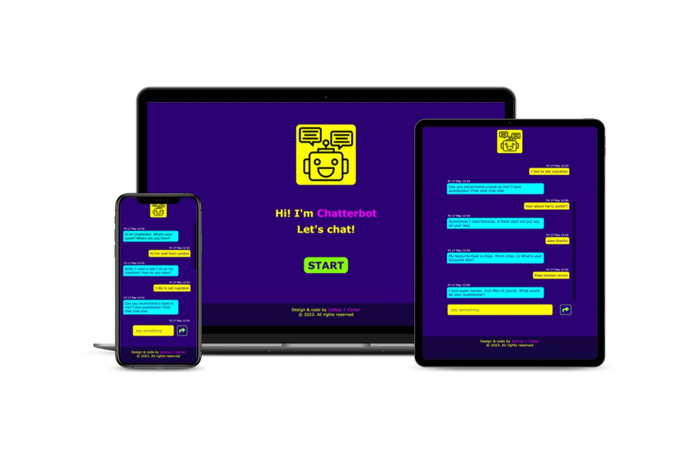

CHATTERBOT
=
### A simple chat application using only HTML, CSS, JavaScript and jQuery. 

### Brief description
* A 'just for funsies' chat application that opens in the browser  
* Chatterbot generates a random message, the user can post their own  
* Screen auto scrolls to most recent message
* Each message includes date and time sent   

<!-- ### Image -->


### Features 
* Hand-coded vanilla HTML, CSS, JavaScript and jQuery
* Responsive mobile-first app 
* Juicy colour palette on a clean, flat design. 

### Getting started  
```code
open 'index.html'
```
### Tech stack / technologies
Good old HTML, CSS, JavaScript, and jQuery